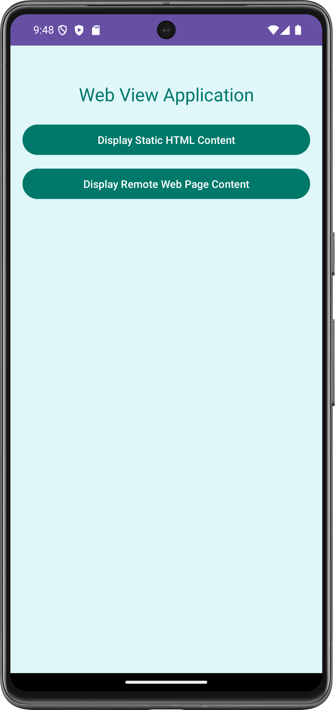
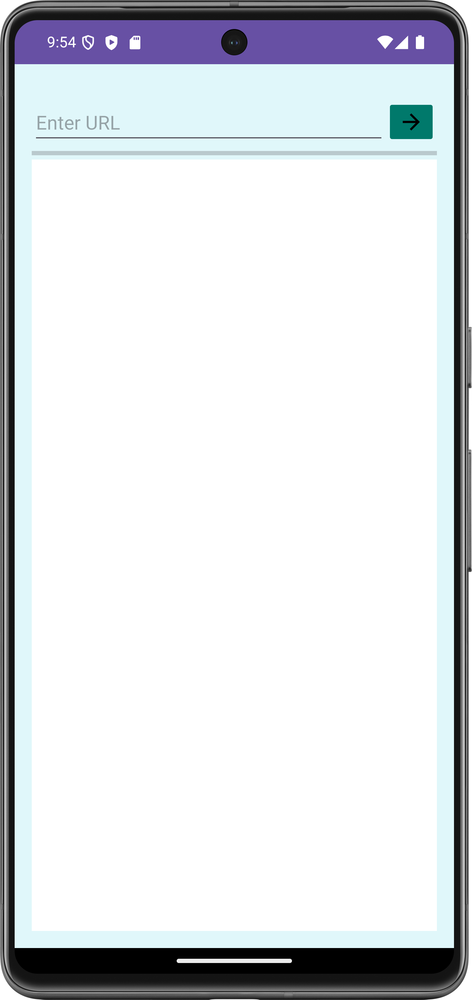
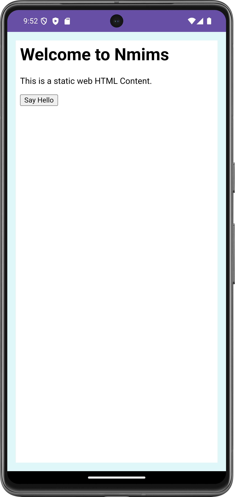

# WebViewApp

## Description

**WebViewApp** is an Android application showcasing the use of WebView to display web content and static HTML. The app features URL validation, loading indicators, and JavaScript interaction.

## Features

- **WebView Integration**: Load and display web pages within the app.
- **URL Validation**: Ensure user input for URLs is valid to prevent loading errors.
- **Loading Indicators**: Display a progress bar while content is loading.
- **Static HTML Content**: Show static HTML content with interactive elements.
## Screenshots

### MainActivity


### Remote Content Activity


#### Initial View


#### Empty Field Alert
.png)

#### Invalid Format Alert
.png)

#### Success
.png)


### Static Content Activity


## Technologies Used

- **Android Studio**: IDE for Android app development.
- **Java**: Programming language used for this application.
- **WebView**: Component for displaying web content.
- **JavaScript Interface**: Enables communication between JavaScript and Android code.

## Getting Started

### Prerequisites

- Android Studio installed.
- Basic understanding of Android development and Java.

### Installation

1. **Clone the repository:**

   ```sh
   git clone https://github.com/VedantKothari01/WebViewApp.git

2. **Open the project in Android Studio:**
   - Launch Android Studio.
   - Select "Open an existing project" and navigate to the cloned repository folder.
   - Open the project and let Android Studio build it.

3. **Run the app:**
   - Connect an Android device or start an emulator.
   - Click the "Run" button in Android Studio to deploy the app.

### Usage

- **Main Screen**: Enter a URL in the input field.
- **Load URL**: Click the arrow button to load the URL in the WebView.
- **Error Handling**: If the URL is invalid or improperly formatted, an alert will be displayed.

### Contributing

Contributions are welcome! Please feel free to fork the repository and submit pull requests. Please follow the project's coding standards and include relevant tests.
